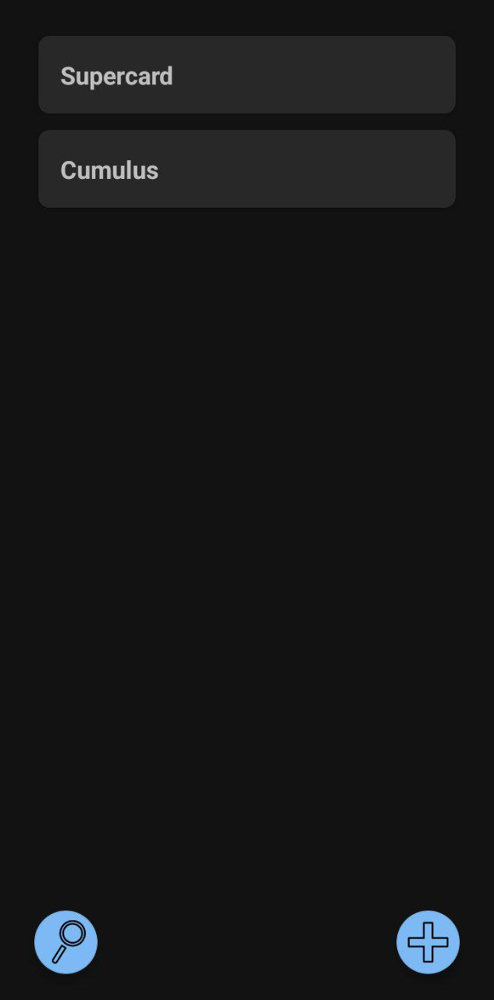
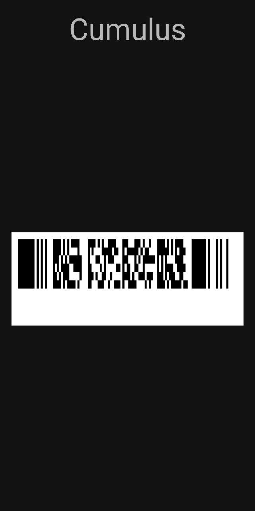
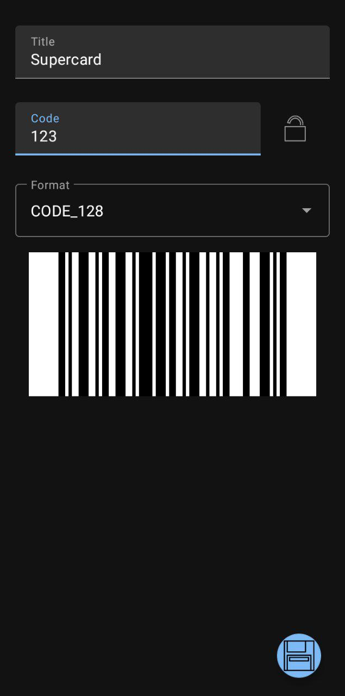

<!--suppress ALL -->


<div align="center">
  <h1>Keepass Fidelity</h1>
  <p>A minimalist fidelity/loyalty card plugin</p>
  
  
  <br>
    <a href="https://github.com/choelzl/keepass-fidelity/actions/workflows/build.yml">
    
  </a>
</div>

## 🌄 Screenshots

<div align="center">
  <table>
    <tr>
      <td style="width: 33%; height: 100px;"></td>
      <td style="width: 33%; height: 100px;"></td>
      <td style="width: 33%; height: 100px;"></td>
    </tr>
  </table>
</div>

## ⭐ Features

- Search entries in [Keepass2Android](https://github.com/PhilippC/keepass2android/)
- Scan & Create entries
- Recently used history for fast access
- Protect entries from caching
- Minimalist design and features
- Supported Formats:CODE_39, CODE_93, CODE_128, EAN_8, EAN_13, UPC_A, UPC_E, CODE_QR, PDF_417, AZTEC, CODABAR, DATA_MATRIX, ITF

## 📳 Installation

<div style="display: flex; justify-content: center; align-items: center; flex-direction: row;">
    <a href="https://github.com/choelzl/keepass-fidelity/releases/latest">
        
    </a>
</div>

## ⚙️ Permissions

- `CAMERA`: necessary for the scanning of barcodes

## 📝 Contribute

Keepass-Fidelity is a user-driven project. We welcome any contribution, big or small.

- **🖥️ Development:** Fix bugs, implement features, or research issues. Open a PR for review.
- **🍥 Design:** Improve interfaces, including accessibility and usability.
- **📂 Issue Reporting:** Report bugs and edge cases with relevant info.
- **🌍 Localization:** Translate if it doesn't support your language.

## ✏️ Acknowledgements

Thanks to all contributors, the developers of our dependencies, and our users.

## 📝 License

```
Copyright (C) 2024 Helcel

Licensed under the Unlicense
For more information, please refer to <https://unlicense.org>
```